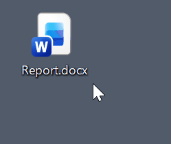

# InsertDate

<div align="center">



**One Team. One Date.**

*Professional date standardization for modern businesses*

[🌐 Website](https://insertdate.com) • [💳 Purchase License](https://buy.stripe.com/9B68wQ7Va0ZR3sScZPbwk00) • [📧 Support](mailto:info@insertdate.com)

</div>

---

## 💡 The Problem

Does this sound familiar?

- Reports named `2026-02-14`, `02.14.2026`, `14/02/2026` — impossible to sort, impossible to find
- Is `02/14/2026` February 14th or the 2nd of a nonexistent month? Ambiguous dates cause costly errors
- Team members constantly asking "How should I format this date?" — wasting valuable time

**Small inconsistencies add up to big headaches.**

## ✨ The Solution

InsertDate is a lightweight, portable Windows utility that **eliminates date format chaos** across your entire organization.

### How It Works

1. **Choose Your Format** — Select from yyyyMMdd, yyyy/MM/dd, yyyy.MM.dd, or yyyy年MM月dd日
2. **Run Once** — Extract and run the .exe file. No installation required. Works silently in the background.
3. **Press Insert** — Anywhere you're typing—documents, emails, file names—press the **Insert key** for perfect formatting

**One key. One format. Every time.**

## 🎯 Key Benefits

- ✅ **Instant Compliance** — Everyone follows the same standard from day one. No training required.
- 🔍 **Easy File Management** — Files sort correctly by date automatically. Find what you need in seconds.
- 💰 **Eliminate Errors** — No more ambiguous dates causing confusion in invoices, contracts, or reports.
- ⚡ **Zero Maintenance** — Extract and run. No configuration, minimal resources, never needs updates.
- 🌐 **Works Everywhere** — Functions in any Windows application—Word, Excel, Outlook, file explorer, web browsers.
- 🔒 **Secure & Verified** — Code-signed by SSL.com, verified by VirusTotal. Your data stays on your computer.

## 📦 Available Formats

Choose the version that matches your organization's standard. All versions are **portable** (no installation required).

| Format | Example | Download | Security Audit |
|--------|---------|----------|----------------|
| **Standard** | `20260214` | [📥 Download ZIP](https://github.com/InsertDate/InsertDate/releases/download/v1.0/InsertDate_v1.0.zip) | [🛡️ VirusTotal](https://www.virustotal.com/gui/url/ade8d5614f2c7d050a51854fad319abc4d0525656281d931017ba8d1217b1a64?nocache=1) |
| **Slash** | `2026/02/14` | [📥 Download ZIP](https://github.com/InsertDate/InsertDate/releases/download/v1.0/InsertDate-Slash_v1.0.zip) | [🛡️ VirusTotal](https://www.virustotal.com/gui/url/247b59d3669a3aba69543c5f8070825856396e9b279066d54da52096662d4f66?nocache=1) |
| **Dot** | `2026.02.14` | [📥 Download ZIP](https://github.com/InsertDate/InsertDate/releases/download/v1.0/InsertDate-Dot_v1.0.zip) | [🛡️ VirusTotal](https://www.virustotal.com/gui/url/f2ee69d9f81b6048a7f58aea10eec10357d52563e8741df367af2712d473ec60?nocache=1) |
| **East Asia** | `2026年02月14日` | [📥 Download ZIP](https://github.com/InsertDate/InsertDate/releases/download/v1.0/InsertDate-EA_v1.0.zip) | [🛡️ VirusTotal](https://www.virustotal.com/gui/url-analysis/u-5ddc1641deb2ce055ac4094ca5b0cd774506efe0fdd909dbcb6197b67e147b5a-ae302314) |

## 🛡️ Security & Trust

### Digital Signature
All executables are **digitally signed** with an **SSL.com IV Code Signing Certificate**, verified by Microsoft Windows for your security.

### Integrity Verification (SHA-256)

```
InsertDate_v1.0.zip:       0666E347461BC90078316EB6CDB9A3A22482B40AADCFAB40C09AD77879174304
InsertDate-Slash_v1.0.zip: 46E1E592079059D9272717C1347F092069B1AB587B16D91703D60367F9EA489A
InsertDate-Dot_v1.0.zip:   BB5B7C33287A923F41FBEF0B3F13498BB8A2E8274611D8997FEEBDBE4658437A
InsertDate-EA_v1.0.zip:    B6740762B69B2391C648FBE8341E7A62B60102FF372F2E3F9458F6466D588B9F
```

### Windows SmartScreen
If Windows SmartScreen displays a warning, click **"More info"** then **"Run anyway"**. This is normal for newly released software. All packages are code-signed and virus-free.

## 💳 Licensing

| License Type | Price | Use Case |
|--------------|-------|----------|
| **Personal** | **Free** | Individual, non-commercial use |
| **Commercial** | **$39 USD / device** | Business, organizational use |

**Commercial licenses include:**
- ✅ Commercial use rights
- ✅ All format options
- ✅ Lifetime updates
- ✅ Priority support
- ✅ Volume discounts available
- ✅ 1-week free trial

[**Purchase Commercial License →**](https://buy.stripe.com/9B68wQ7Va0ZR3sScZPbwk00)

## 🚀 Quick Start

1. **Download** your preferred format from the table above
2. **Extract** the ZIP file to any location
3. **Run** the `.exe` file (no installation needed)
4. **Press Insert key** to insert today's date in any application

That's it! The app runs silently in your system tray.

## 💻 System Requirements

- **OS**: Windows 7 or later (Windows 10/11 recommended)
- **Architecture**: x64
- **Disk Space**: < 1 MB
- **Memory**: Minimal (runs in background)
- **Permissions**: No admin rights required

## ❓ FAQ

### Why can't I customize the date format?

**By design.** InsertDate's strength is its simplicity. Offering customization would defeat the purpose—ensuring everyone on your team uses the exact same format. Choose one version that matches your organization's standard and deploy it to everyone.

### Does it work in all applications?

Yes. InsertDate works system-wide in any Windows application where you can type: Microsoft Office, web browsers, file explorers, IDEs, email clients, and more.

### Is it really portable?

Yes. No installation required. Just extract and run. Perfect for USB drives, network shares, or deployment via group policy.

### What about privacy?

InsertDate runs entirely locally on your computer. No data is collected, transmitted, or stored remotely. Your information never leaves your device.

## 📞 Support

- **Email**: [info@insertdate.com](mailto:info@insertdate.com)
- **Website**: [https://insertdate.com](https://insertdate.com)
- **Issues**: [GitHub Issues](https://github.com/InsertDate/InsertDate/issues)

## 📜 Legal

- [Privacy Policy](https://insertdate.com/privacy)
- [Legal Notice](https://insertdate.com/legal)

---

<div align="center">

**Developed in Japan. Trusted worldwide.**

*Launched on Valentine's Day 2026 🎁*

© 2026 InsertDate. All rights reserved.

</div>
